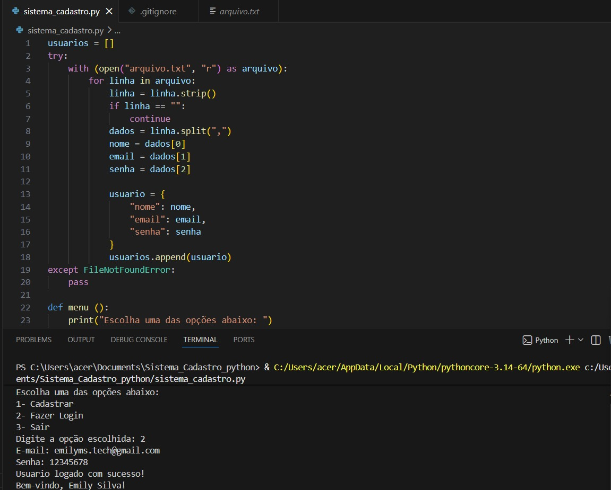

# Sistema de Cadastro em Python

## Sobre o projeto

Esse projeto foi desenvolvido com o objetivo de praticar lógica de programação em Python.
A ideia foi criar um sistema simples de cadastro e login, com os dados sendo salvos em um arquivo `.txt`, para que não se percam ao fechar o programa.

---
## Exemplo de uso


## Funcionalidades

* Cadastro de usuários
* Validação de senha (mínimo de 4 caracteres)
* Impede cadastro com e-mail já existente
* Login com verificação de dados
* Salvamento dos usuários em arquivo
* Leitura automática dos dados ao iniciar

---

## Como executar

1. Clone o repositório:

```
git clone https://github.com/seu-usuario/sistema-cadastro-python.git
```

2. Acesse a pasta:

```
cd sistema_cadastro_python
```

3. Execute o arquivo:

```
sistema_cadastro.py
```

---

## O que eu aprendi com esse projeto

* Trabalhar com listas e dicionários
* Criar funções e organizar melhor o código
* Validar dados de entrada
* Ler e escrever arquivos em Python

---

## Observação

O arquivo `arquivo.txt` não foi incluído no repositório para evitar expor dados.

---

## Autora

Desenvolvido por mim como parte dos meus estudos em programação.
